# Trello Board View — UI/UX Reference

Deep teardown of Trello's board view, captured live from a real board
(`trello.com/b/.../afaf`) on 2026-06-29. Every value below was **measured from
the running app** (computed styles + Atlassian Design System CSS custom
properties), not estimated. Screenshots are in
[`assets/trello-board/`](./assets/trello-board/).

This is a **design reference**, not a spec — it documents what Trello does so we
can decide, per surface, what Planora adopts, adapts, or rejects. A
Planora-mapping note closes each major section. See also
[`docs/product/boards-and-cards.md`](../product/boards-and-cards.md),
[`workspaces-and-access.md`](../product/workspaces-and-access.md), and
[`realtime-sync.md`](../product/realtime-sync.md).

---

## 1. Design language at a glance

Trello now renders on the **Atlassian Design System (ADS)** token set (557 CSS
variables on `:root`, prefixed `--ds-*`). This is the single most useful finding:
the entire visual system is a published, internally-consistent token palette we
can mirror into our Tailwind 4 `@theme` / oklch variables in `app/globals.css`.

- **Type family:** `Atlassian Sans` (variable font), mono `Atlassian Mono`.
- **Bold = weight 653**, not 700 — a variable-font optical weight. Medium = 500.
- **Light theme**, flat surfaces, very subtle 1px elevation shadows.
- **Brand blue `#1868DB`** drives every primary action, link, focus, and
  selected state.
- The chrome (top nav + board header) is a **darker blue gradient** that sits
  over the board's background; board content is light.

---

## 2. Design tokens (measured)

### 2.1 Color — semantic tokens

| Token | Value | Used for |
| --- | --- | --- |
| `--ds-text` | `#292A2E` | Primary body/card text |
| `--ds-text-subtle` | `#505258` | List titles, secondary text, icon buttons |
| `--ds-text-subtlest` | `#6B6E76` | Meta/timestamps |
| `--ds-text-inverse` | `#FFFFFF` | Text on dark chrome / bold fills |
| `--ds-text-disabled` | `#080F214A` (29% black) | Disabled |
| `--ds-link` / `--ds-background-brand-bold` | `#1868DB` | Links, primary buttons, focus accent |
| `--ds-link-pressed` / `--ds-text-accent-blue` | `#1558BC` | Pressed/hover primary |
| `--ds-text-danger` | `#AE2E24` | Destructive text |
| `--ds-text-success` | `#4C6B1F` | Success text |

### 2.2 Color — surfaces, backgrounds, borders

| Token | Value | Used for |
| --- | --- | --- |
| `--ds-surface` / `-raised` / `-overlay` | `#FFFFFF` | Cards, popovers, modals |
| `--ds-surface-sunken` | `#F8F8F8` | Page/canvas behind cards |
| List background (measured) | `#F1F2F4` | List column body |
| `--ds-background-neutral` | `#0515240F` (~6% black) | Ghost/secondary button rest |
| `--ds-background-neutral-hovered` | `#0B120E24` (~14% black) | Ghost button hover |
| `--ds-background-neutral-bold` | `#292A2E` | Bold neutral (e.g. active toggle) |
| `--ds-background-input` | `#FFFFFF` | Text inputs |
| `--ds-background-selected` | `#E9F2FE` | Selected row / info background |
| `--ds-background-selected-bold` | `#1868DB` | Selected checkbox fill |
| `--ds-background-danger` | `#FFECEB` | Error surface |
| `--ds-background-success` | `#EFFFD6` | Success surface |
| `--ds-background-warning` | `#FFF5DB` | Warning surface |
| `--ds-border` | `#0B120E24` | Hairline dividers, card borders |
| `--ds-border-bold` | `#7D818A` | Stronger separators |
| `--ds-border-input` | `#8C8F97` | Input outline |
| `--ds-border-focused` | `#4688EC` | Focus ring |
| `--ds-border-selected` | `#1868DB` | Selected outline |

### 2.3 Color — label / accent palette (the "bolder" ramp)

The card-label colors. Trello also ships a **colorblind-friendly mode** (on by
default here) that overlays a distinct **texture pattern** on each label — a
detail worth copying for accessibility (see §7.3).

| Name | `--ds-background-accent-*-bolder` |
| --- | --- |
| Blue | `#1868DB` |
| Green | `#1F845A` |
| Lime | `#5B7F24` |
| Yellow | `#946F00` |
| Orange | `#BD5B00` |
| Red | `#C9372C` |
| Magenta | `#AE4787` |
| Purple | `#964AC0` |
| Teal | `#227D9B` |

Each color has a 4-step ramp (`subtlest → subtler → subtle → bolder`), each with
`-hovered`/`-pressed` variants — i.e. the full ADS accent matrix is available.

### 2.4 Typography scale

| Token | Size / line-height | Weight | Used for |
| --- | --- | --- | --- |
| `--ds-font-heading-xxlarge` | 32 / 36px | 653 | — |
| `--ds-font-heading-xlarge` | 28 / 32px | 653 | — |
| `--ds-font-heading-large` | 24 / 28px | 653 | Card title (modal) |
| `--ds-font-heading-medium` | 20 / 24px | 653 | **List name** |
| `--ds-font-heading-small` | 16 / 20px | 653 | Section headings |
| `--ds-font-heading-xsmall` | 14 / 20px | 653 | Sub-headings |
| `--ds-font-body-large` | 16 / 24px | 400 | Board name (16px) |
| `--ds-font-body` | 14 / 20px | 400 | **Card title, default UI** |
| `--ds-font-body-small` | 12 / 16px | 400 | Meta, badges |

### 2.5 Spacing, radius, elevation

- **Space scale (`--ds-space-*`):** `025`=2px · `050`=4px · `075`=6px ·
  `100`=8px · `150`=12px · `200`=16px · `250`=20px · `300`=24px · `400`=32px.
  Everything snaps to this 4px-based grid.
- **Radius (`--ds-radius-*`):** `xsmall`=2 · `small`=4 · `medium`=6 ·
  `large`=8 · `xlarge`=12 · `xxlarge`=16 · `full`=pill.
- **Elevation:**
  - `--ds-shadow-raised` = `0 1px 1px #1E1F2140, 0 0 1px #1E1F214F` — cards & lists.
  - `--ds-shadow-overlay` = `0 8px 12px #1E1F2126, 0 0 1px #1E1F214F` — popovers & modals.

---

## 3. Layout anatomy

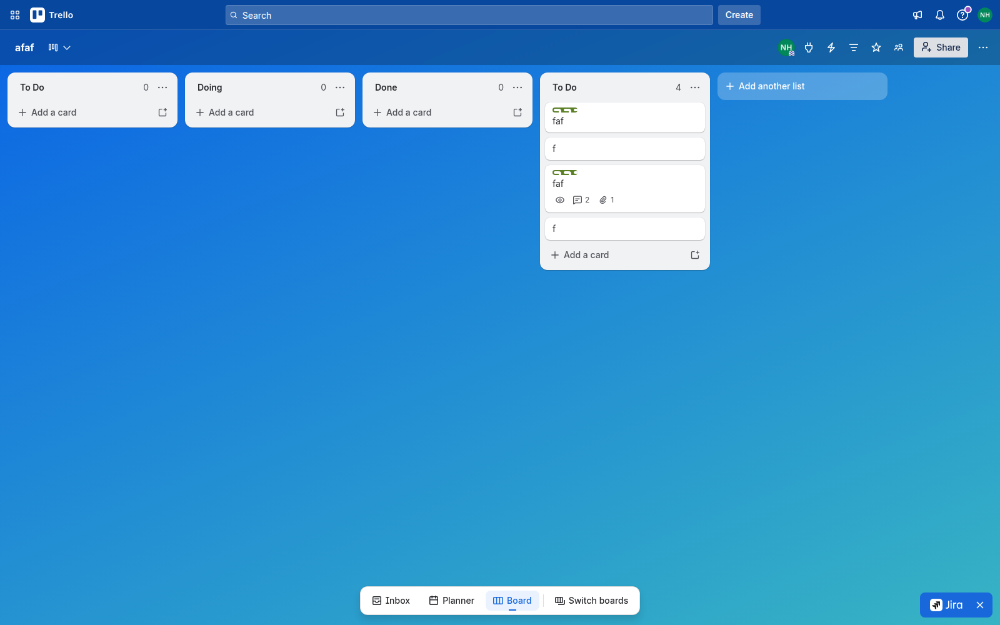

Three stacked horizontal bands plus a floating footer:

### 3.1 Top app bar — global chrome
- **Height 48px**, blue (`rgb(8,71,158)`), 8px padding, 8px gap.
- Left: apps/waffle grid · Trello logo+wordmark.
- Center: global **Search** (full-width pill input).
- Right: **Create** button (32px tall, radius 4px, `rgba(255,255,255,.2)` fill,
  white text, weight 500) · notifications · help · info · account avatar.

### 3.2 Board header — board-scoped chrome
- **Height 56px**, translucent `rgba(0,0,0,.24)` over the board background.
- Left: **board name** (16px / 653 / white) + view-switcher caret.
- Right (icon cluster): member facepile w/ **online presence dot**, power-ups,
  automation (⚡), **filter** (funnel), **star**, members, **Share** button
  (32px, radius 4px, `#DCDFE4` fill, `#172B4D` text), board-menu `⋯`.

### 3.3 Board canvas
- Transparent; shows the board background (color/gradient/photo).
- Horizontal-scrolling row of **lists**; a trailing **+ Add another list**
  placeholder column.

### 3.4 Floating bottom nav
- Centered white pill: **Inbox · Planner · Board (active, underlined) · Switch
  boards**. View-level navigation, deliberately separated from board chrome.

---

## 4. The List column

| Property | Measured value |
| --- | --- |
| Column pitch | **284px** (4 lists evenly spaced) |
| List content width | **272px** (6px horizontal padding each side → **12px gutter**) |
| Background | `#F1F2F4` |
| Radius | **12px** (`xlarge`) |
| Shadow | `--ds-shadow-raised` |
| Header padding | `8px 8px 0` |
| Title | 20 / 24px, weight 653, `#505258` (`heading-medium`) |
| Cards container padding | `4px` |
| Gap between cards | **8px** |
| Footer "Add a card" | 32px tall, radius 8px, padding `6px 12px 6px 8px`, weight 500 |

List header = **title + card count + `⋯` menu**. The count is muted; the menu
opens the List actions popover (§6.2).

---

## 5. The Card tile

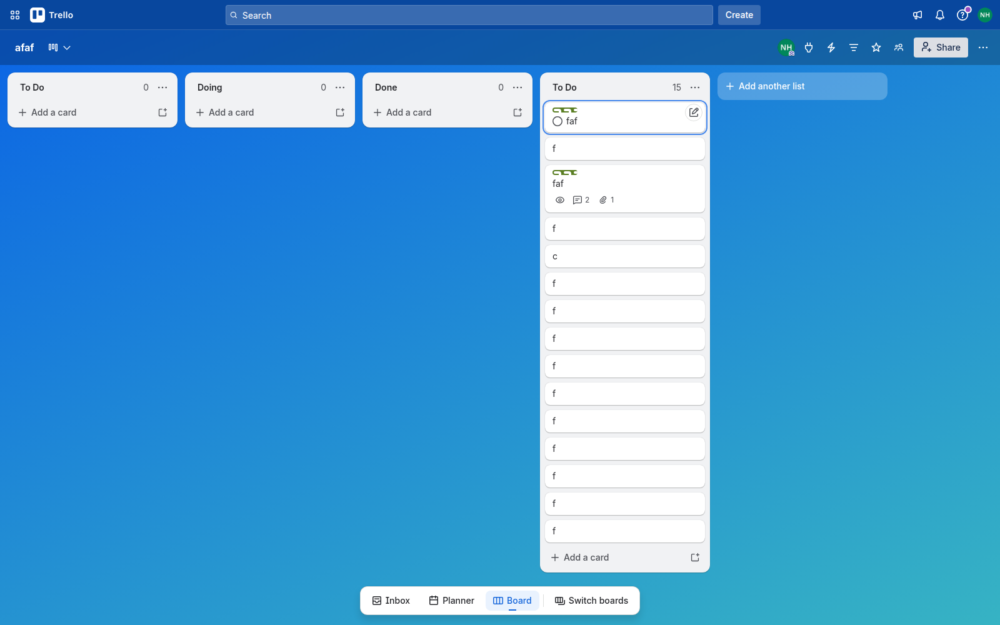

| Property | Measured value |
| --- | --- |
| Background | `#FFFFFF` |
| Radius | **8px** (`large`) |
| Shadow | `--ds-shadow-raised` |
| Width | 256px (list content minus 2×8px) |
| Title | 14 / 20px, weight 400, `#292A2E` |
| Heights observed | **36px** (title only) · **48px** (label + title) · **76px** (label + title + badges) |

**Anatomy, top to bottom:**
1. **Label chips** — compact mode = `40×8px` colored bars, radius 4px, with
   colorblind texture overlay. Expand to text labels on click.
2. **Card title** (single/multi-line, 14px).
3. **Badge footer** — 4px-gapped icon+count row: watch (eye), comments (`💬 2`),
   attachments (`📎 1`), plus due-date, checklist, etc. when present. (This is
   exactly our **US-037 info-density** pattern.)

**Hover state (important interactions):**
- Card gains a **blue focus outline** (`border-focused`).
- A **pencil quick-edit** button appears top-right (inline edit without opening
  the modal).
- A **completion radio** appears left of the title (mark card complete in place).

---

## 6. Board-level popovers & panels

All popovers share one **anatomy**: white `surface-overlay`, ~8px radius,
`shadow-overlay`, a header row = centered title + top-right **✕ close**, then
body. Widths cluster around **300–360px**. They are **anchored to their trigger**
(not centered) except the Share dialog and Card detail, which are true modals.

### 6.1 Add-a-card composer
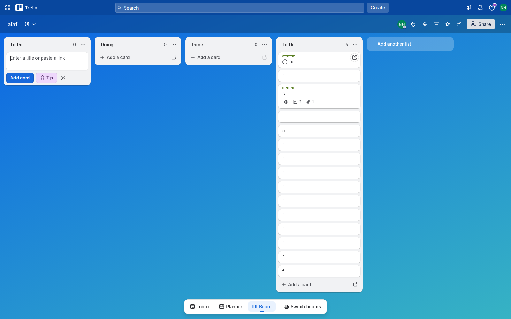
Inline, replaces the footer: auto-growing textarea ("Enter a title or paste a
link"), **Add card** primary button, a "Tip" chip, ✕. Stays open for **rapid
sequential entry**. Commits on Enter; Escape discards.

### 6.2 List actions
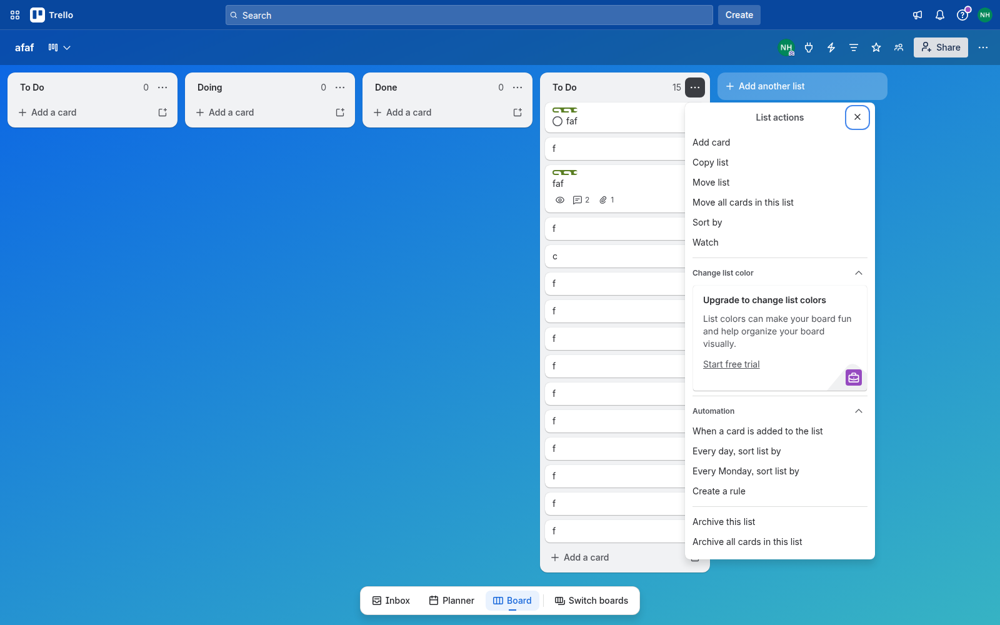
Add card · Copy list · Move list · Move all cards in this list · Sort by · Watch
· *Change list color* (premium) · **Automation** block (when-card-added, daily
sort, rule) · **Archive this list** · Archive all cards.

### 6.3 Filter panel (right-anchored)
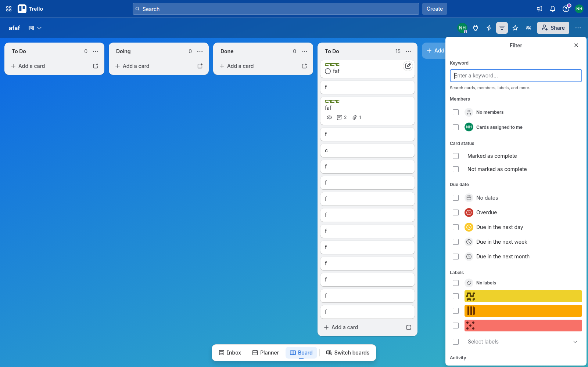
Keyword · Members (No members / assigned to me) · **Card status**
(complete / not) · **Due date** (No dates / Overdue / next day / week / month,
each with a colored clock) · **Labels** (No labels + chips) · Activity.
Client-side board filtering — pure presentation over loaded data.

### 6.4 Create menu & Board menu
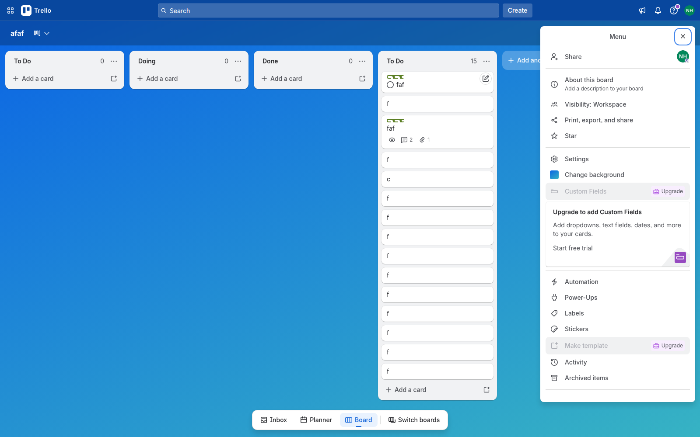
The board `⋯` opens a **right drawer** ("Menu"): Share · About this board ·
Visibility · Print/export · Star · Settings · Change background · Custom Fields
(premium) · Automation · Power-Ups · **Labels** · Stickers · Make template ·
**Activity** · **Archived items**. Note **Activity** and **Archived items** as
first-class board surfaces.

---

## 7. Card detail (route-addressable modal)

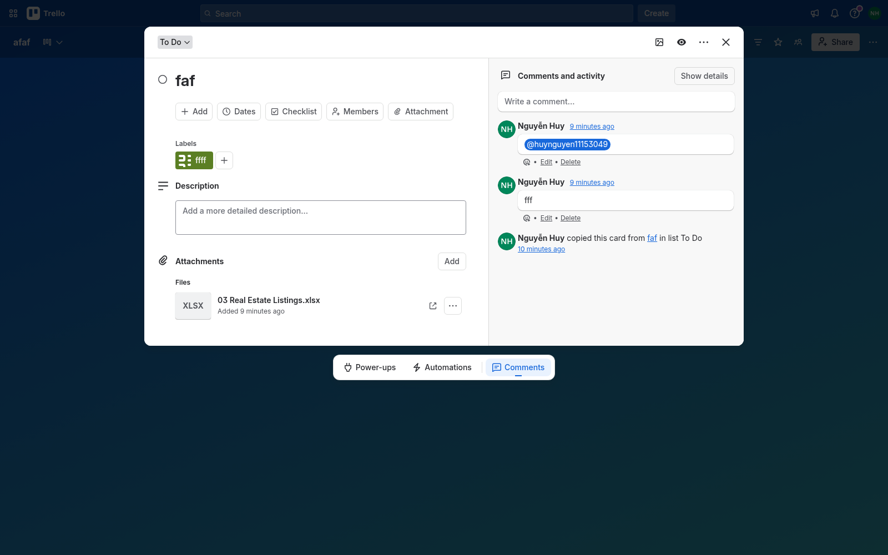

Opening a card navigates to **`/c/<shortlink>/<n>-<slug>`** and renders a
**centered two-column modal** over a dimmed board. It is deep-linkable and
shareable — the URL *is* the card. **Escape closes it.**

**Header:** list-location dropdown (`To Do ⌄`, move between lists) · cover-image
· watch (eye) · `⋯` · ✕.

**Left column (content):**
- Card title with a **completion circle**.
- Quick-action button row: **Add · Dates · Checklist · Members · Attachment**.
- **Labels** — colored chips + `＋`.
- **Description** — "Add a more detailed description…" (rich text).
- **Attachments → Files** — type thumbnail (XLSX), filename, "Added Xm ago",
  open-in-new + `⋯`.

**Right column (activity):** "Comments and activity" + **Show details** toggle ·
comment composer · reverse-chron feed mixing **comments** (avatar, name,
relative time, body, **Edit · Delete**) and **system activity** ("copied this
card from … in list To Do"). This is our `card-history` / activity model.

### 7.1 Dates editor
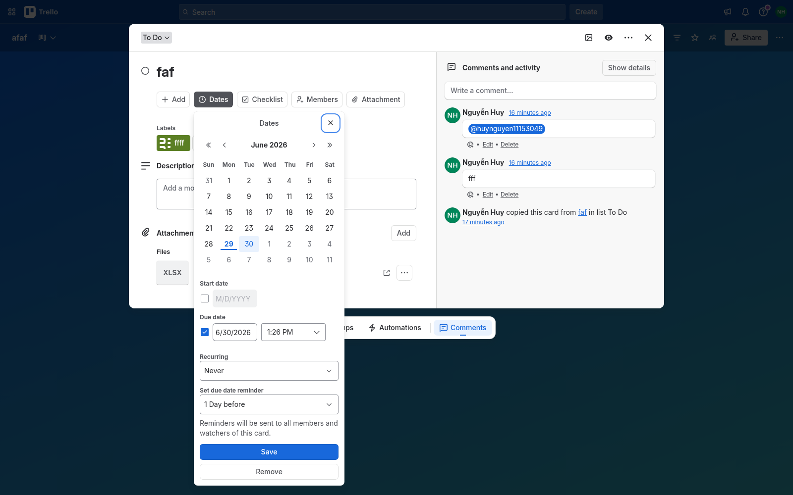
Full month calendar (◀ ▶ nav, today underlined, selected day filled brand-blue)
+ **Start date** · **Due date** (date + time) · **Recurring** · **Reminder** ·
Save / Remove. Directly comparable to our **US-039** Calendar+Popover.

### 7.2 Members & Checklist editors
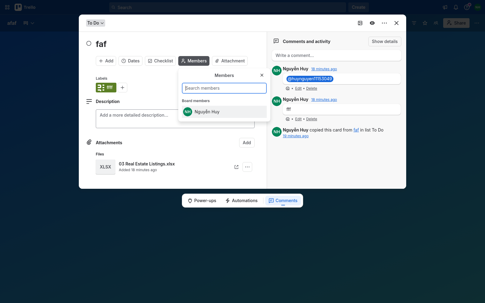
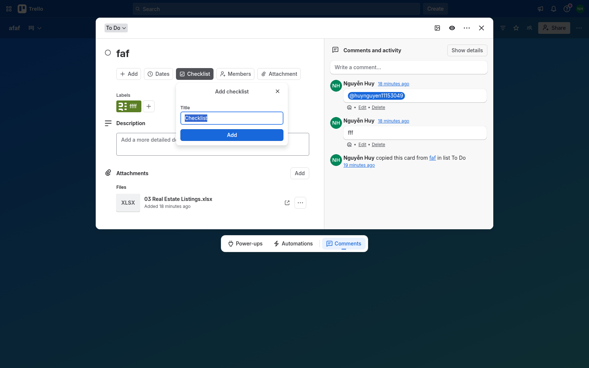
Members: search + "Board members" list (avatar + name, toggle to assign).
Checklist: "Add checklist" with a pre-filled Title and Add button.

### 7.3 Labels editor (+ accessibility)
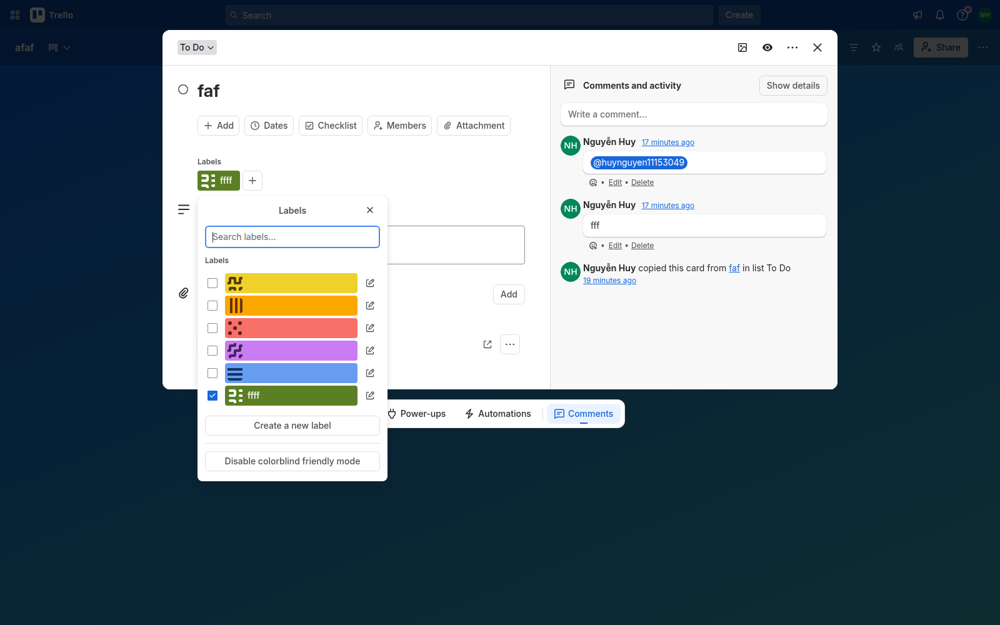
Search · label rows (checkbox + colored bar **with texture pattern** + edit
pencil) · **Create a new label** · **Disable colorblind friendly mode** toggle.
The texture-on-color approach makes labels distinguishable without relying on
hue — recommend adopting.

---

## 8. Sharing & roles

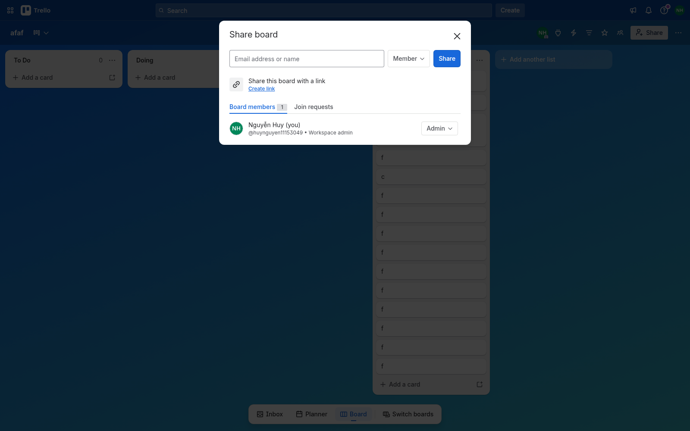

Centered **Share board** modal: email/name input + **role dropdown (Member)** +
Share · "Share with a link / Create link" · tabs **Board members (N) | Join
requests** · member rows = avatar, name "(you)", `@handle • Workspace admin`,
**role dropdown (Admin)**.

**Role mapping to Planora** (`lib/permissions.ts`): Trello Admin → our **admin**,
Trello Member → our **editor**, Trello Observer → our **viewer**. The
invite-by-email + per-member role dropdown + join-requests pattern is the
template for our workspace access UI.

---

## 9. Responsive

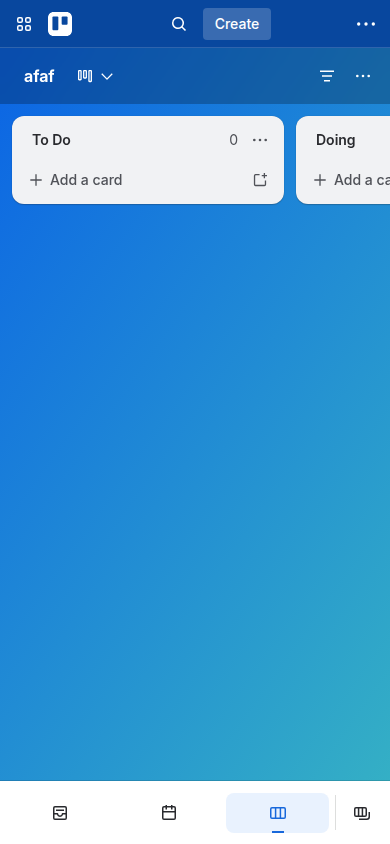

At 390px the structure is unchanged: condensed top bar (waffle · logo · search
icon · Create · `⋯`), board header (name · view-switcher · filter · `⋯`), and
lists become **near-full-width columns you swipe horizontally** (one list fills
the viewport, the next peeks). The bottom nav becomes an **icon-only tab bar**.
Single responsive layout — no separate mobile shell — driven by relative widths.

---

## 10. Interaction & motion principles

- **Anchored popovers** for contextual edits; **centered modals** only for the
  full card and Share. Both use `shadow-overlay`.
- **Inline-first editing**: add-card composer, card quick-edit pencil, in-place
  complete — minimize full-modal trips.
- **Optimistic + persistent composers**: the add-card box stays open for batch
  entry.
- **Keyboard**: Escape closes the top layer; Enter commits composers.
- **Selected/focus** always communicated with brand-blue (`border-focused`
  ring, `background-selected` fill).

---

## 11. Planora adoption checklist

What we already match, and where this reference should steer us:

| Area | Planora today | Reference takeaway |
| --- | --- | --- |
| Card badges | US-037 info density ✔ | Match icon+count footer, 4px gap, 12px meta |
| Date picker | US-039 Calendar+Popover ✔ | Add start/recurring/reminder to reach parity |
| Presence | US-041 live avatars ✔ | Trello shows online dot on facepile — same idea |
| Boards grid | US-038 auto-fill grid ✔ | — |
| Design tokens | Tailwind4 oklch in `globals.css` | **Port the ADS semantic ramp** (text/surface/border/accent) as named tokens; bold = a heavier weight, not just 700 |
| List/card metrics | — | Column 272px + 12px gutter; card radius 8px, list radius 12px; 8px card gap; `shadow-raised` |
| Card detail | planned | **Make it route-addressable** (`/c/...`), two-column, Escape-to-close, activity feed = `card-history` |
| Labels | schema exists | Add **colorblind texture mode** for a11y |
| Filtering | — | Client-side board filter panel (keyword/member/status/due/label) |
| Roles UI | admin/editor/viewer in `permissions.ts` | Share dialog: invite + per-member role dropdown + join requests |
| Board menu | — | Surface **Activity** and **Archived items** as board-level views |

> Caveat: Trello/ADS is a mature, premium-gated product; several panels show
> upsells (Custom Fields, list colors, templates). Treat those as out of scope —
> this reference is about the **free-tier interaction model and visual system**,
> which is what Planora targets.

---

## Appendix — research method

Captured with headless Chrome (puppeteer) authenticated via the board owner's
session cookie. Tokens were read from `getComputedStyle(:root)` (557 `--ds-*`
vars) and per-element computed styles keyed off Trello's `data-testid`
attributes (`list-wrapper`, `trello-card`, `card-name`, `board-header`, …). Raw
dumps: `tokens.json`, `palette.json` (kept in the research scratchpad, not
committed). Screenshots regenerated at 1600×1000 (desktop) and 390×844 (mobile).
